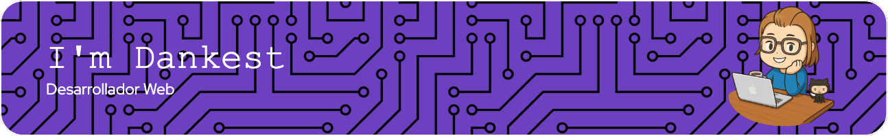

  
  ¡Hola! Soy Kilian

⚡ **Siempre curioso y en constante crecimiento.**

## 🐍 Snake en mi cuadrícula de contribuciones

## 🛠️ Habilidades actuales:

  
  
  
  
  
  
  
  
  
  

## 🌱 Actualmente aprendiendo:

  
  
  

## 🤔 ¿Sabías que...?

- Para mí, la programación es como resolver acertijos: cuanto más difícil es el problema, más satisfactoria es la solución.
- Mi objetivo es, algún día, lanzar una plataforma de **eCommerce** que sea intuitiva y escalable.
- Aunque llevo poco más de un año en este mundo, ¡estoy disfrutando cada paso del proceso! 😄

## 📫 ¿Quieres saber más o colaborar?

- Puedes enviarme un correo a: [kilianjs@gmail.com](mailto:kilianjs@gmail.com)
- ¡Me encantaría escuchar consejos, ideas o colaborar en proyectos interesantes!

---

  

    <h3 style="margin: 0;">Musica ❤️</h3>
  

  

    
  

## Contacto:

  
  

